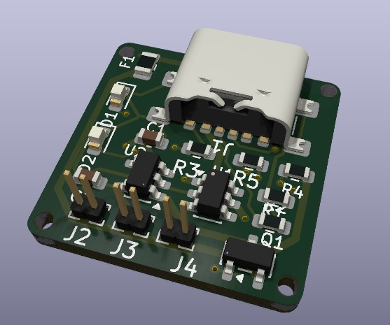
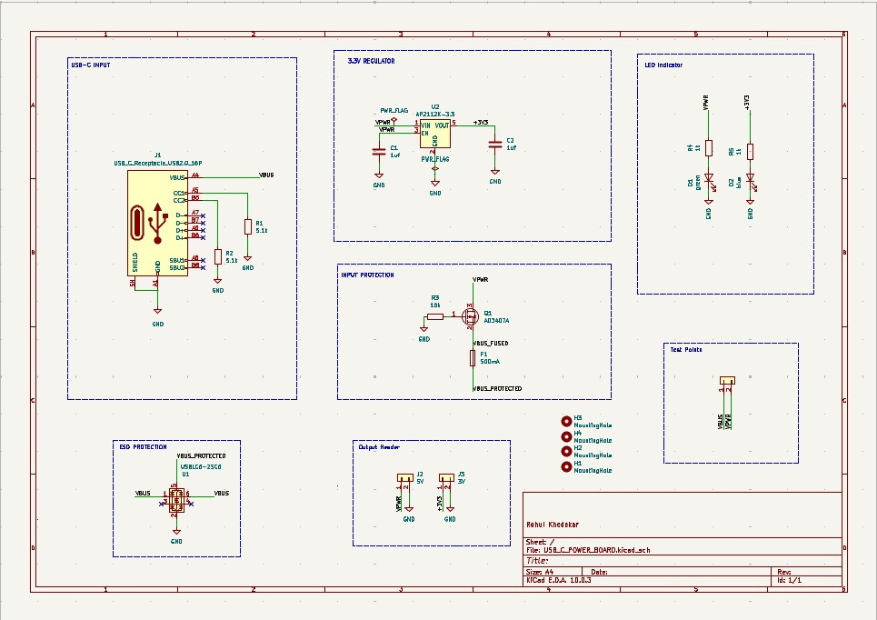
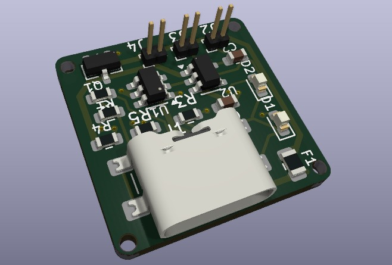

<div align="center">

# ⚡ USB-C Power Distribution Board

### 🚀 My First 4-Layer PCB Design using KiCad 10



<br>


---

A beginner-friendly **4-layer USB-C Power Distribution Board**
designed completely in **KiCad 10**.

This project was created to learn professional PCB design workflow,
component placement, routing, power distribution and PCB manufacturing.

</div>

---

# 📖 Project Overview

This PCB accepts **5V input from a USB Type-C connector**, protects the input against faults, generates a regulated **3.3V supply**, and provides convenient output connectors for powering external electronics.

The project focuses on learning real-world PCB design practices including schematic capture, ERC/DRC verification, multilayer stack-up planning, and clean routing.

---

# ✨ Features

- ✅ USB Type-C Power Input
- ✅ USB-C CC Configuration
- ✅ ESD Protection
- ✅ Resettable Polyfuse
- ✅ Reverse Polarity Protection
- ✅ 3.3V LDO Regulator
- ✅ 5V Output Header
- ✅ 3.3V Output Header
- ✅ Power Status LEDs
- ✅ 4-Layer PCB
- ✅ Gerber Files Included

---

# 🏗 Hardware Architecture

```text
                   USB-C Input
                        │
                        ▼
               ESD Protection IC
                        │
                        ▼
               Resettable Polyfuse
                        │
                        ▼
            Reverse Polarity MOSFET
                        │
         ┌──────────────┴──────────────┐
         │                             │
         ▼                             ▼
      5V Output                 AP2112 LDO
                                       │
                                       ▼
                                  3.3V Output
```

---

# ⚡ Power Flow

```text
USB-C
   │
   ▼
USBLC6
   │
   ▼
 Polyfuse
   │
   ▼
 AO3407A
   │
   ├────────► 5V Output
   │
   ▼
 AP2112K
   │
   ▼
3.3V Output
```

---

# 📷 Project Gallery

## 📝 Schematic



---

## 🖥 PCB Layout


---

## 🔵 Top Copper Layer


---

## 🟢 Ground Plane


---

## 🟠 Power Plane


---

## 🔴 Bottom Copper Layer


---

## 🎨 3D View (Front)


---

## 🎨 3D View (Back)



---

# 🧩 Major Components

| Component | Purpose |
|------------|---------|
| USB Type-C Receptacle | Power Input |
| USBLC6-2SC6 | ESD Protection |
| Polyfuse | Overcurrent Protection |
| AO3407A PMOS | Reverse Polarity Protection |
| AP2112K-3.3 | 3.3V Voltage Regulation |
| LEDs | Power Indicators |
| Output Headers | 5V & 3.3V Outputs |

---

# 🏗 PCB Stack-Up

| Layer | Function |
|--------|----------|
| Top Layer | Components + Signal Routing |
| Inner Layer 1 | Solid Ground Plane |
| Inner Layer 2 | Power Plane |
| Bottom Layer | Signal Routing |

---

# 🛠 Software Used

- KiCad 10
- Git
- GitHub

---

# 📂 Repository Structure

```
USB_C_POWER_BOARD
│
├── Gerber/
├── USB_C_POWER_BOARD/
│
├── schematic.jpeg
├── all layer.jpeg
├── 3D1.jpeg
├── 3D2.jpeg
├── 1st layer.png
├── 2nd layer.png
├── 3rd layer.png
├── 4th layer.png
└── README.md
```

---

# 📚 What I Learned

✔ Designing Schematics in KiCad

✔ Selecting Symbols & Footprints

✔ PCB Component Placement

✔ Power Distribution

✔ Ground Plane Design

✔ 4-Layer PCB Stack-Up

✔ PCB Routing

✔ Design Rule Check (DRC)

✔ Electrical Rule Check (ERC)

✔ Gerber Generation

---

# 🚀 Future Improvements

- USB Power Delivery (USB-PD)
- Current Monitoring
- Power Switch
- Reverse Current Protection
- Thermal Optimization
- PCB Manufacturing & Testing

---

# 📄 License

This project is released under the MIT License.

---

<div align="center">

## ⭐ If you found this project interesting, consider giving it a Star!

**Thanks for visiting!**

</div>
